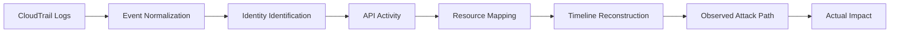

# KlaudTrace

> **An AWS post-attack analysis tool for reconstructing cloud incidents from evidence and determining what actually happened.**

---

## Overview

Cloud incidents can generate thousands of AWS API events across identities, roles, services, and resources.

The first problem after a suspected compromise is not:

> "What *could* this attacker have done?"

It is:

> **"What did the attacker actually do?"**

**KlaudTrace** focuses on answering that question.

Given AWS CloudTrail activity, KlaudTrace analyzes and correlates events to reconstruct an incident by identifying:

- Which identity was involved
- What actions were performed
- Which AWS resources were targeted
- When the activity occurred
- How identities and sessions changed
- What sequence of actions occurred
- What attack path can be observed from the evidence
- What impact can be established from the observed activity

The project will eventually expand into **pre-attack attack-surface and blast-radius analysis**, but that is intentionally outside the current scope.

---

## Current Phase — Post-Attack Analysis



---

## Important Evidence Rule

KlaudTrace strictly separates:

- **OBSERVED EVIDENCE**: Direct facts recorded within individual CloudTrail log records.
- **CORRELATED EVIDENCE**: Explicit connections established across records (e.g. matching temporary STS session credentials issued during `sts:AssumeRole` to subsequent downstream API calls).
- **INFERRED RELATIONSHIPS**: Reasonable causal interpretations based on temporal proximity and resource context (e.g. S3 GetObject on encrypted data followed by KMS Decrypt for that key in the same session).
- **UNDETERMINED**: Unobserved or missing evidence (e.g. an assumed role session whose originating `AssumeRole` call is outside the ingested log slice). **Never fabricated into a false correlation.**

KlaudTrace never confuses access with exfiltration:
`s3:GetObject` establishes data access, but does **not** by itself establish data exfiltration beyond the cloud environment.

---

## Quickstart & Installation

### Prerequisites
- Go 1.22+ (tested on Go 1.27)

### Build
```bash
go build -o bin/klaudtrace ./cmd/klaudtrace
```

### Run
```bash
# Full incident analysis
./bin/klaudtrace analyze fixtures/cloudtrail/scenario1/events.json

# Chronological timeline of API events
./bin/klaudtrace timeline fixtures/cloudtrail/scenario1/events.json

# Visualized observed attack and activity paths
./bin/klaudtrace paths fixtures/cloudtrail/scenario1/events.json

# Generate Markdown report with Mermaid diagrams
./bin/klaudtrace report fixtures/cloudtrail/scenario1/events.json --format=markdown --output=report.md

# Generate complete machine-readable JSON
./bin/klaudtrace report fixtures/cloudtrail/scenario1/events.json --format=json
```

---

## Flagship PayFlow Scenarios

KlaudTrace includes synthetic test fixtures for the PayFlow fintech environment:

| Scenario | Path | Description |
| :--- | :--- | :--- |
| **Scenario 1** | `fixtures/cloudtrail/scenario1/events.json` | **Transaction Data Access**: `AssumeRole` $\rightarrow$ S3 `GetObject` (`payflow-transaction-data`) $\rightarrow$ `kms:Decrypt` $\rightarrow$ S3 `GetObject` (`payflow-account-data`). |
| **Scenario 2** | `fixtures/cloudtrail/scenario2/events.json` | **KMS Misuse**: `AssumeRole` $\rightarrow$ `kms:Decrypt` on sensitive payment token encryption key. |
| **Scenario 3** | `fixtures/cloudtrail/scenario3/events.json` | **Privilege Escalation & Evasion**: `ConsoleLogin` $\rightarrow$ `iam:CreateRole` $\rightarrow$ `iam:PutRolePolicy` $\rightarrow$ `sts:AssumeRole` $\rightarrow$ `cloudtrail:DeleteTrail`. |
| **Scenario 4** | `fixtures/cloudtrail/scenario4/events.json` | **Cross-Bucket Data Movement**: S3 `GetObject` on transaction data $\rightarrow$ S3 `PutObject` to secondary bucket within same session. |
| **Benign** | `fixtures/cloudtrail/benign/events.json` | **Routine Operations**: Normal worker SQS receive, routine app log read, scheduled EventBridge role assumption. Confirms zero false positive security findings. |

---

## Fintech Asset Classification

Resources are categorized according to sensitivity and fintech business domain:

- `transaction_data` (`CRITICAL`): Transaction records, ledger histories, settlement files.
- `payment_credentials` (`CRITICAL`): Payment token keys, cardholder data keys.
- `customer_pii` (`CRITICAL`): Customer identity and contact records.
- `kyc_data` (`CRITICAL`): Identity verification and passports.
- `account_data` (`HIGH`): Customer balances and routing information.
- `audit_data` (`HIGH`): Security trails and compliance logs.
- `application_logs` (`LOW`): Operational runtime logs.

Custom classification rules can be supplied via `--config <path>`:
```json
{
  "rules": [
    {
      "pattern": "mycompany-ledger.*",
      "domain": "fintech",
      "asset_type": "transaction_data",
      "sensitivity": "CRITICAL",
      "description": "General ledger archives"
    }
  ]
}
```

---

## Testing & Determinism

Run the complete test suite:
```bash
go test -v -race ./...
```

The test suite includes:
- Unit tests for parser tolerance and malformed log handling
- Identity correlation and role chaining tests
- Universal resource extraction tests
- End-to-end scenario evaluations
- 100% byte-for-byte golden file comparisons in `tests/golden/`
- Determinism verification asserting identical SHA-256 output hashes across repeated runs.
