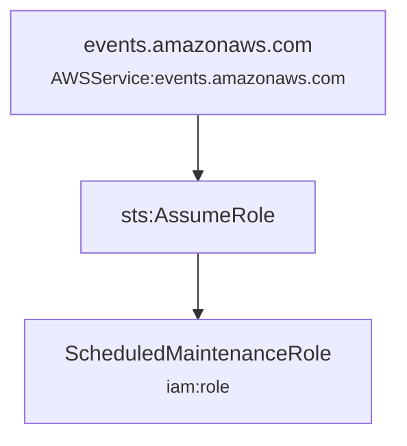
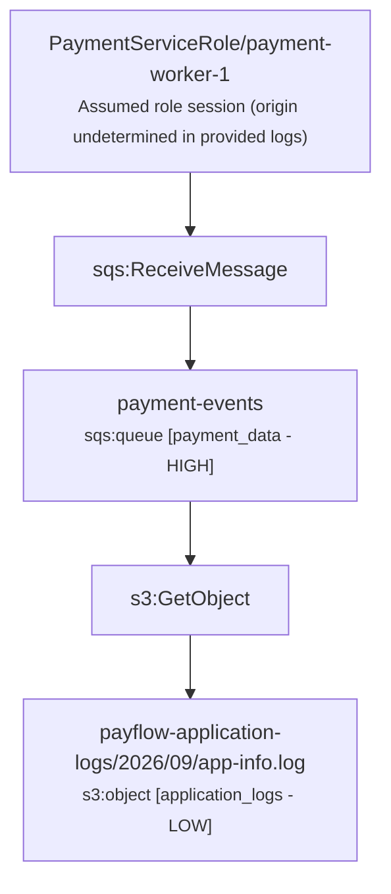

# KlaudTrace Incident Reconstruction Report

## Executive Summary

> **Assessment:** Activity is consistent with routine authorized operations. No sensitive resource access, privilege escalation, or destructive actions were established by the supplied evidence.

| Metric | Value |
| :--- | :--- |
| **Time Window** | `2026-09-15T18:00:00Z` to `2026-09-15T18:06:00Z` (6m0s) |
| **Total Log Records** | `3` |
| **Error / Denied Events** | `0` |
| **Identities Tracked** | `2` |
| **Classified Assets Affected** | `2` |

## Identified Principals & Sessions

| Principal / Session | Type | Account ID | Session Issuer | Lineage Confidence |
| :--- | :--- | :--- | :--- | :--- |
| `PaymentServiceRole/payment-worker-1` | AssumedRole | `123456789012` | `PaymentServiceRole` | **UNDETERMINED** |
| `events.amazonaws.com` | AWSService | `` | `-` | **OBSERVED** |

## Affected Classified Assets

| Resource | Type | Domain | Asset Type | Sensitivity |
| :--- | :--- | :--- | :--- | :--- |
| `payflow-application-logs/2026/09/app-info.log` | `s3:object` | infrastructure | `application_logs` | **LOW** |
| `payment-events` | `sqs:queue` | fintech | `payment_data` | **HIGH** |

## Observed Activity & Attack Paths

### Observed Path #1: events.amazonaws.com activity

**Confidence Level:** `OBSERVED`  
**Summary:** Identity events.amazonaws.com executed 1 observed actions across 1 resources.

### Observed Path #2: PaymentServiceRole/payment-worker-1 activity

**Confidence Level:** `OBSERVED`  
**Summary:** Identity PaymentServiceRole/payment-worker-1 executed 2 observed actions across 2 resources.

## Impact Findings

_No high-severity impact findings triggered._

