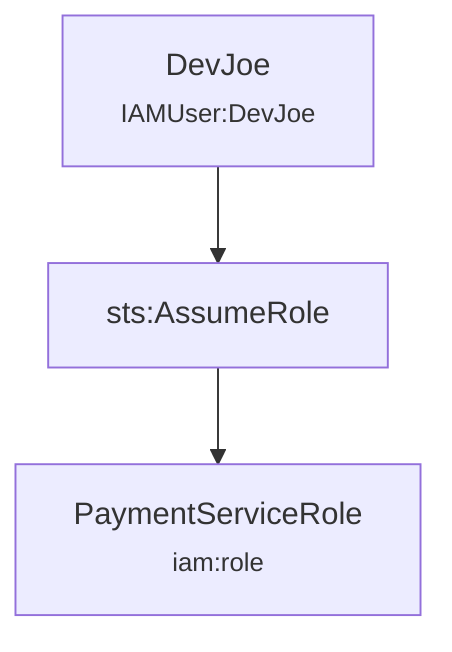
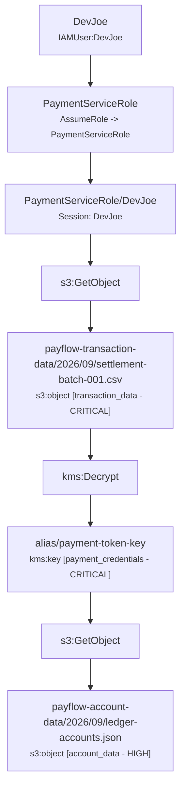

# KlaudTrace Incident Reconstruction Report

## Executive Summary

> **Assessment:** CloudTrail evidence establishes activity involving identities [DevJoe, PaymentServiceRole/DevJoe]. Access or modification to classified resources was observed: [alias/payment-token-key (payment_credentials / CRITICAL), payflow-account-data/2026/09/ledger-accounts.json (account_data / HIGH), payflow-transaction-data/2026/09/settlement-batch-001.csv (transaction_data / CRITICAL)]. The supplied CloudTrail evidence by itself does not establish that data was exfiltrated beyond the AWS environment.

| Metric | Value |
| :--- | :--- |
| **Time Window** | `2026-09-15T14:20:00Z` to `2026-09-15T14:25:05Z` (5m5s) |
| **Total Log Records** | `4` |
| **Error / Denied Events** | `0` |
| **Identities Tracked** | `2` |
| **Classified Assets Affected** | `3` |

## Identified Principals & Sessions

| Principal / Session | Type | Account ID | Session Issuer | Lineage Confidence |
| :--- | :--- | :--- | :--- | :--- |
| `DevJoe` | IAMUser | `123456789012` | `-` | **OBSERVED** |
| `PaymentServiceRole/DevJoe` | AssumedRole | `123456789012` | `PaymentServiceRole` | **CORRELATED** |

## Affected Classified Assets

| Resource | Type | Domain | Asset Type | Sensitivity |
| :--- | :--- | :--- | :--- | :--- |
| `alias/payment-token-key` | `kms:key` | fintech | `payment_credentials` | **CRITICAL** |
| `payflow-account-data/2026/09/ledger-accounts.json` | `s3:object` | fintech | `account_data` | **HIGH** |
| `payflow-transaction-data/2026/09/settlement-batch-001.csv` | `s3:object` | fintech | `transaction_data` | **CRITICAL** |

## Observed Activity & Attack Paths

### Observed Path #1: DevJoe activity

**Confidence Level:** `OBSERVED`  
**Summary:** Identity DevJoe executed 1 observed actions across 1 resources.

### Observed Path #2: PaymentServiceRole/DevJoe activity

**Confidence Level:** `CORRELATED`  
**Summary:** Identity PaymentServiceRole/DevJoe executed 3 observed actions across 3 resources.

## Impact Findings

### [CRITICAL] Observed Access to Sensitive Fintech Data

- **Description:** CloudTrail evidence confirms access to sensitive resources: payflow-transaction-data/2026/09/settlement-batch-001.csv (transaction_data / CRITICAL), payflow-account-data/2026/09/ledger-accounts.json (account_data / HIGH).
- **Evidence Basis:** Direct s3:GetObject API calls recorded with success response.
- **Confidence:** `OBSERVED`
- **Limitations:** The supplied CloudTrail evidence establishes resource access. It does not by itself establish data exfiltration beyond the AWS environment.

### [CRITICAL] Observed Cryptographic Decryption of Sensitive Keys

- **Description:** CloudTrail evidence records 1 kms:Decrypt operations involving cryptographic keys.
- **Evidence Basis:** Direct kms:Decrypt API call successfully processed.
- **Confidence:** `OBSERVED`
- **Limitations:** Evidence confirms decryption was performed; decrypted plain-text content is not stored in CloudTrail logs.

