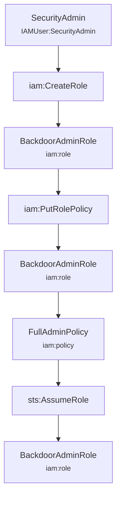
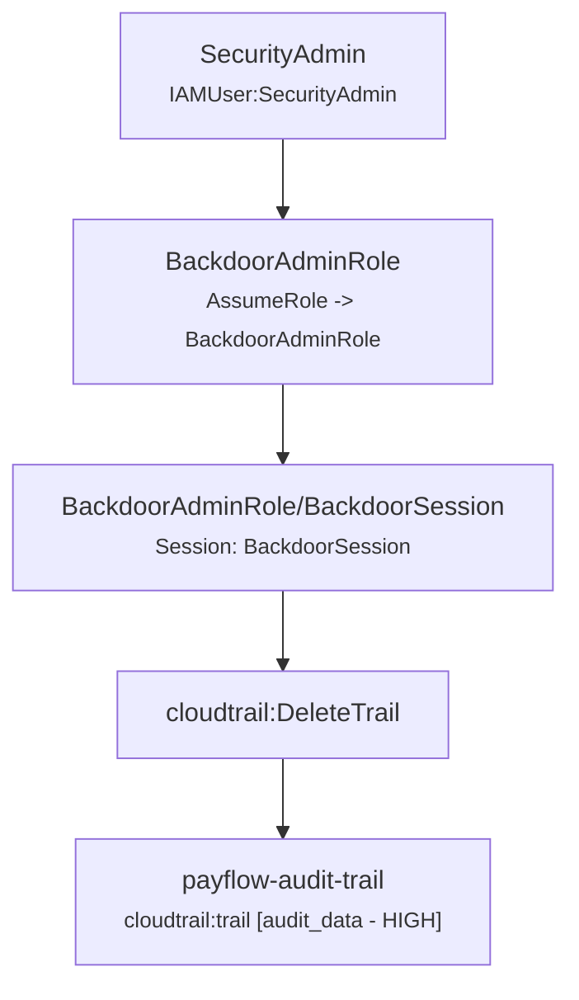

# KlaudTrace Incident Reconstruction Report

## Executive Summary

> **Assessment:** CloudTrail evidence establishes activity involving identities [BackdoorAdminRole/BackdoorSession, SecurityAdmin]. Access or modification to classified resources was observed: [payflow-audit-trail (audit_data / HIGH)]. The supplied CloudTrail evidence by itself does not establish that data was exfiltrated beyond the AWS environment.

| Metric | Value |
| :--- | :--- |
| **Time Window** | `2026-09-15T16:00:00Z` to `2026-09-15T16:10:00Z` (10m0s) |
| **Total Log Records** | `5` |
| **Error / Denied Events** | `0` |
| **Identities Tracked** | `2` |
| **Classified Assets Affected** | `1` |

## Identified Principals & Sessions

| Principal / Session | Type | Account ID | Session Issuer | Lineage Confidence |
| :--- | :--- | :--- | :--- | :--- |
| `BackdoorAdminRole/BackdoorSession` | AssumedRole | `123456789012` | `BackdoorAdminRole` | **CORRELATED** |
| `SecurityAdmin` | IAMUser | `123456789012` | `-` | **OBSERVED** |

## Affected Classified Assets

| Resource | Type | Domain | Asset Type | Sensitivity |
| :--- | :--- | :--- | :--- | :--- |
| `payflow-audit-trail` | `cloudtrail:trail` | compliance | `audit_data` | **HIGH** |

## Observed Activity & Attack Paths

### Observed Path #1: SecurityAdmin activity

**Confidence Level:** `OBSERVED`  
**Summary:** Identity SecurityAdmin executed 3 observed actions across 3 resources.

### Observed Path #2: BackdoorAdminRole/BackdoorSession activity

**Confidence Level:** `CORRELATED`  
**Summary:** Identity BackdoorAdminRole/BackdoorSession executed 1 observed actions across 1 resources.

## Impact Findings

### [HIGH] Observed Administrative Role / Policy Creation

- **Description:** IAM configuration changes creating or escalating roles and policies were observed in the event stream.
- **Evidence Basis:** Direct IAM administrative API calls recorded with success.
- **Confidence:** `OBSERVED`
- **Limitations:** Activity is consistent with administrative configuration changes or persistence; compromise cannot be asserted without credential authorization context.

### [CRITICAL] Observed Audit Trail / Resource Deletion

- **Description:** Destructive operations impacting audit visibility or resources were observed.
- **Evidence Basis:** Destructive API call recorded with success.
- **Confidence:** `OBSERVED`
- **Limitations:** Logs establish that trail/resource was deleted; subsequent unlogged activity may have occurred after logging ceased.

