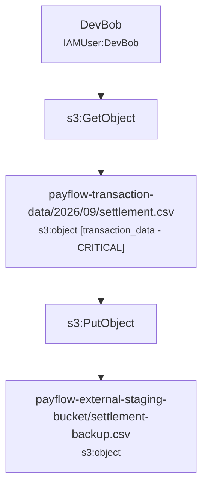

# KlaudTrace Incident Reconstruction Report

## Executive Summary

> **Assessment:** CloudTrail evidence establishes activity involving identities [DevBob]. Access or modification to classified resources was observed: [payflow-transaction-data/2026/09/settlement.csv (transaction_data / CRITICAL)]. The supplied CloudTrail evidence by itself does not establish that data was exfiltrated beyond the AWS environment.

| Metric | Value |
| :--- | :--- |
| **Time Window** | `2026-09-15T17:00:00Z` to `2026-09-15T17:02:15Z` (2m15s) |
| **Total Log Records** | `2` |
| **Error / Denied Events** | `0` |
| **Identities Tracked** | `1` |
| **Classified Assets Affected** | `1` |

## Identified Principals & Sessions

| Principal / Session | Type | Account ID | Session Issuer | Lineage Confidence |
| :--- | :--- | :--- | :--- | :--- |
| `DevBob` | IAMUser | `123456789012` | `-` | **OBSERVED** |

## Affected Classified Assets

| Resource | Type | Domain | Asset Type | Sensitivity |
| :--- | :--- | :--- | :--- | :--- |
| `payflow-transaction-data/2026/09/settlement.csv` | `s3:object` | fintech | `transaction_data` | **CRITICAL** |

## Observed Activity & Attack Paths

### Observed Path #1: DevBob activity

**Confidence Level:** `OBSERVED`  
**Summary:** Identity DevBob executed 2 observed actions across 2 resources.

## Impact Findings

### [CRITICAL] Observed Access to Sensitive Fintech Data

- **Description:** CloudTrail evidence confirms access to sensitive resources: payflow-transaction-data/2026/09/settlement.csv (transaction_data / CRITICAL).
- **Evidence Basis:** Direct s3:GetObject API calls recorded with success response.
- **Confidence:** `OBSERVED`
- **Limitations:** The supplied CloudTrail evidence establishes resource access. It does not by itself establish data exfiltration beyond the AWS environment.

### [HIGH] Observed Cross-Bucket Data Movement

- **Description:** Identity DevBob performed s3:GetObject followed by s3:PutObject across distinct S3 buckets within the same session.
- **Evidence Basis:** Paired s3:GetObject and s3:PutObject API calls executed within the same session lineage.
- **Confidence:** `CORRELATED`
- **Limitations:** Cross-bucket data movement is evidenced. External network exfiltration is not established from CloudTrail alone.

